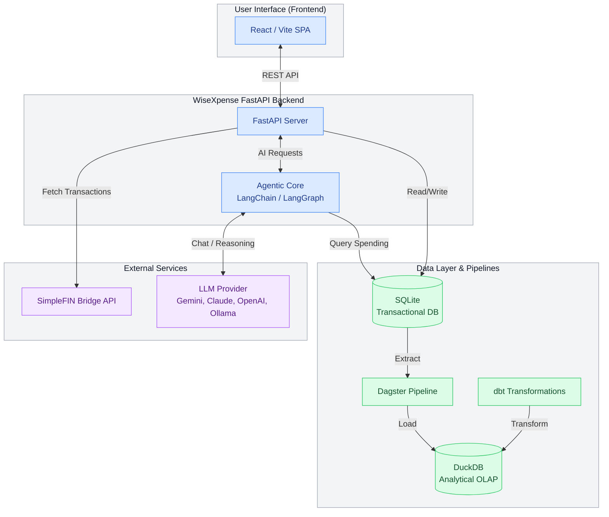

# WiseXpense (in progress)

WiseXpense is a self-hosted, agentic personal finance manager. It tracks spending, categorizes transactions, and provides financial insights via a conversational AI interface. Your data stays local on your machine using an embedded SQLite database.

It uses SimpleFIN Bridge to securely connect read-only bank accounts. Because it is self-hosted and single-user, there are no cloud subscriptions or required logins.

## Quick Start Guide for New Users

Follow these steps exactly to get WiseXpense running on your machine for the first time.

### Step 1: Download and Install
1. Open your terminal app.
2. Clone the repository to your computer by typing:
   `git clone https://github.com/noahnghg/WiseXpense.git`
3. Enter the project folder:
   `cd WiseXpense`
4. Set up an isolated Python environment:
   `python3 -m venv .venv`
5. Activate the environment:
   `source .venv/bin/activate`
6. Install the required packages:
   `pip install -e .`

### Step 2: Configure Your Bank and AI
WiseXpense is 100% private. You need your own SimpleFIN token to connect to your bank, and an API key for your preferred AI.

1. Go to https://bridge.simplefin.org/ in your browser, connect your bank account, and copy your "Setup Token".
2. Go back to your terminal and run the setup wizard:
   `wisexpense setup`
3. Paste the SimpleFIN Setup Token when prompted and hit Enter.
4. Select your preferred AI Provider (Gemini is recommended, but Claude, OpenAI, and local Ollama are supported).
5. Paste the API key for your chosen AI Provider when prompted.

### Step 3: Run the Dashboard
1. Simply start the server by typing:
   `wisexpense start`
2. Wait for the terminal to indicate the application has launched. The tool will automatically initialize the AI brain, connect to SimpleFIN, and fetch your real-time financial data.
3. Open a web browser and go to `http://localhost:8000`. You will see your financial dashboard and agentic chat interface.

### Step 4: Interacting and Syncing
1. Click the "Sync Transactions" button in the web sidebar whenever you want to pull fresh data from your bank.
2. Type queries like "How much did I spend on food this month?" directly into the agentic chat box to analyze your data dynamically.

### Additional Commands
- `wisexpense info`: Check configuration and bank connection status
- `wisexpense reset`: Delete all local transaction data and drop the database
- `dbt run`: Run the analytical data pipeline (requires your virtual environment to be active)

## Architecture

- **Backend**: Python, FastAPI, SQLAlchemy
- **AI Agent**: LangGraph, LangChain
- **Data Engineering**: dbt (Data Build Tool) for transformations
- **Database (Transactional)**: SQLite (stored at `~/.wisexpense/wisexpense.db`)
- **Database (Analytical)**: DuckDB (stored at `~/.wisexpense/wisexpense_analytical.duckdb`)
- **Frontend**: React, Vite (bundled as static files within the Python package)
- **Integration**: SimpleFIN API

## Security Note

Bank credentials are never structurally accessed or stored. The application only accesses read-only data through SimpleFIN Access URLs. Because there are no user accounts, you should only run this application locally on trusted machines.

## License

This project is licensed under the MIT License - see the [LICENSE](LICENSE) file for details.
